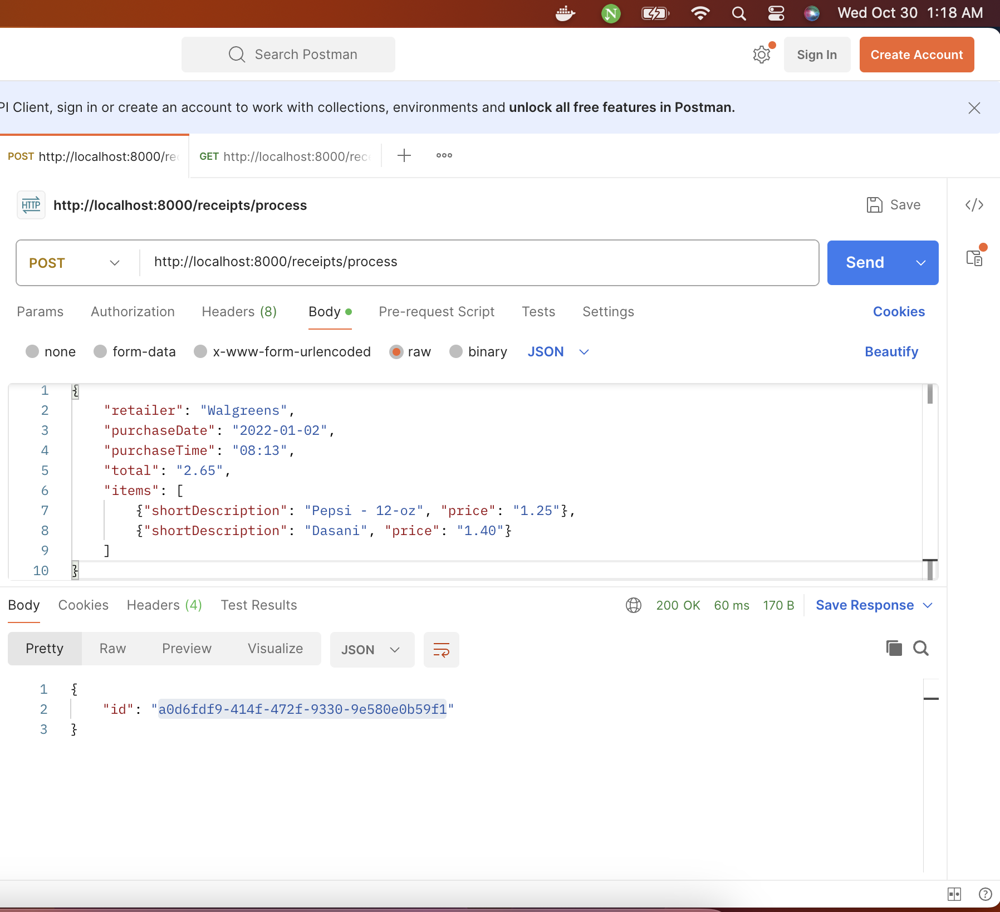
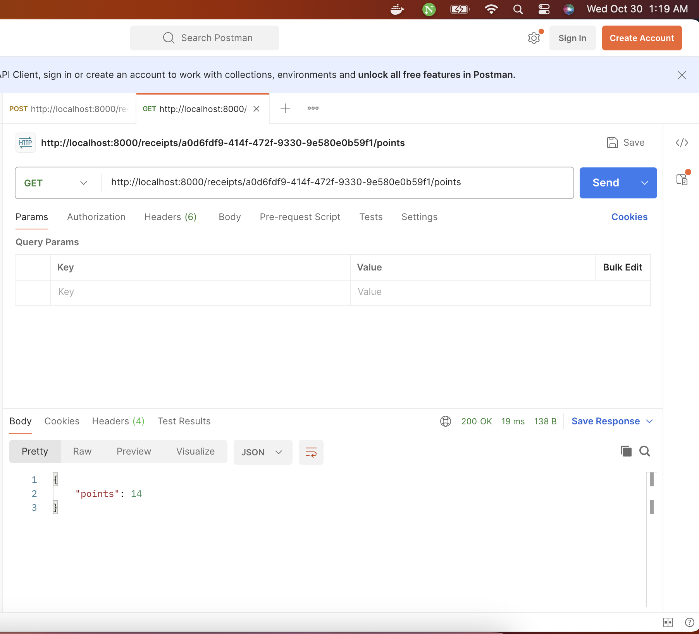
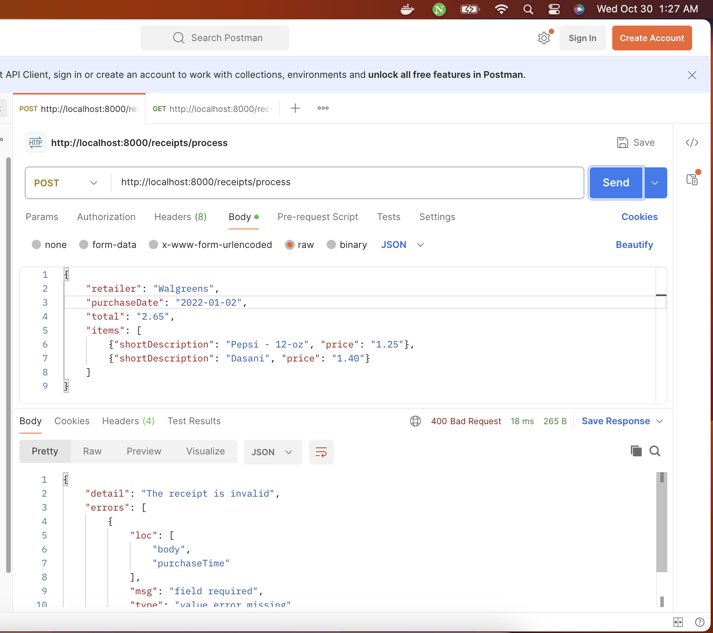
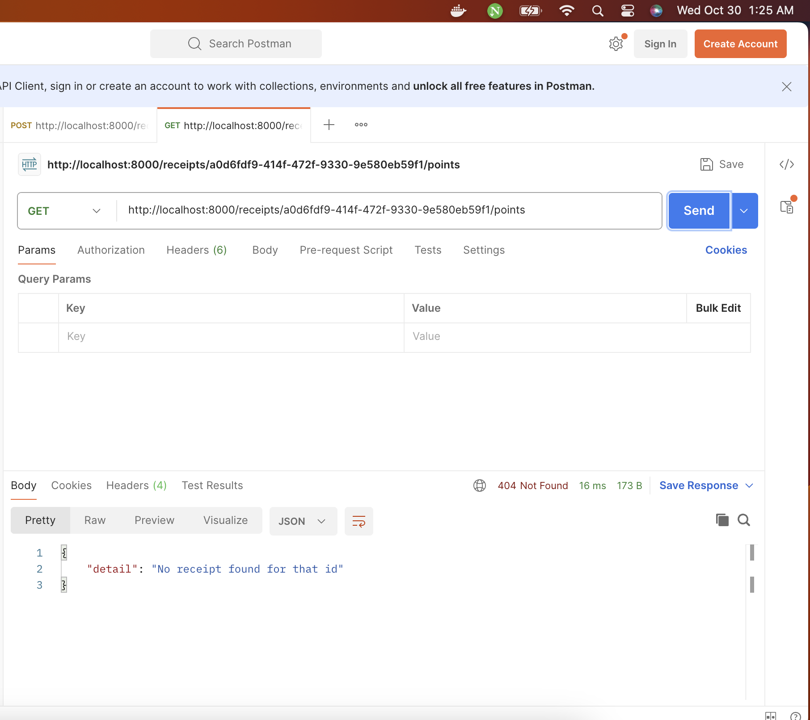

# Receipt Processor

## Instructions to Run the Application:

- Build the docker image using the below command
`docker build -t receipt-processor-app .`

- Run the docker container
`docker run -p 8000:8000 receipt-processor-app`

- The application runs on the `http://localhost:8000`

## Testing the app locally

